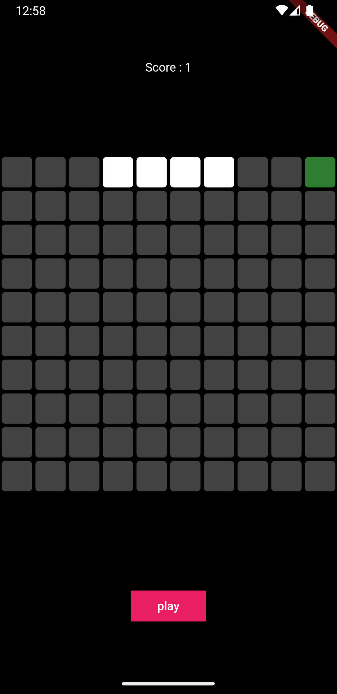
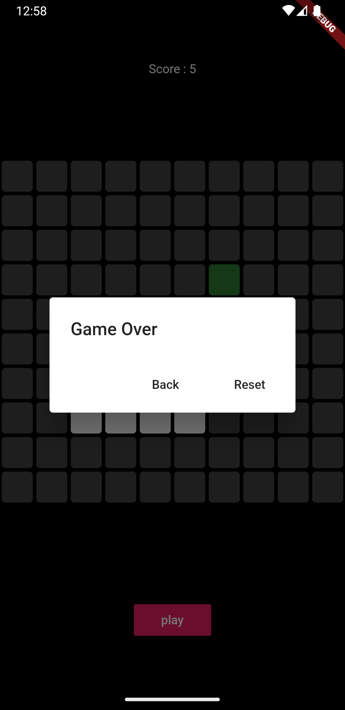
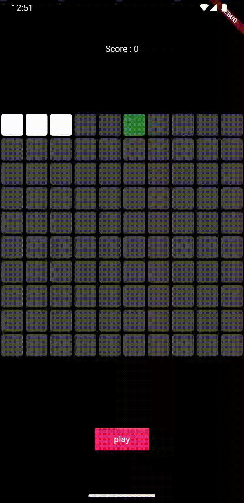

# Flutter Snake Game

This is a simple Flutter Snake Game app that allows you to play the classic Snake game. The game logic is implemented in Dart, and it revolves around controlling the snake, making it move, and handling food interactions.

## Preview

  
  
  

## Game Logic

The game is controlled by the `_GamePageState` class, which handles the core logic of the snake movement and food interactions.

### Snake Movement

The snake's movement is controlled using the `SnakeDirection` enum, which represents the direction the snake is moving. The possible directions are `RIGHT`, `LEFT`, `UP`, and `DOWN`.

The `snakePixels` list keeps track of the positions of the snake's body pixels. Each pixel is represented by a single integer, which corresponds to its position in a one-dimensional grid of size 100 (10x10 grid).

The snake moves by adding new pixels to the end of the `snakePixels` list, based on its current direction. When a new pixel is added, the last pixel is removed, effectively creating the illusion of movement.

### Eating Food

The food pixel is represented by the `foodPixel` variable, which holds the position of the food pixel in the grid. When the snake collides with the food pixel (i.e., when its head occupies the same position as the food pixel), the snake "eats" the food.

Upon eating the food, the player's score increases, and a new food pixel is randomly generated on the grid. The new food pixel's position is determined using a random number generator (`Random().nextInt(100)`), and it is ensured that the food does not spawn on the snake's body.

### Game Over

The `gameOver()` function checks for collision between the snake's head and its body. If any two pixels in the `snakePixels` list have the same position, it indicates that the snake collided with itself, and the game is over.

When the game is over, a dialog box is displayed, giving the player the option to either go back or reset the game. The player's score is displayed in the dialog box.

## Contributing

If you find any bugs, have suggestions for improvements, or want to add new features to the game, feel free to open an issue or submit a pull request. Your contributions are highly appreciated.

## Acknowledgments

The game was created based on the youtube's video [flutter_snake_games](https://www.youtube.com/watch?v=9jvJyLhJP00&t=2141s). Special thanks to the original author for making the code available for use and modification.

Have fun playing! 🐍🎮